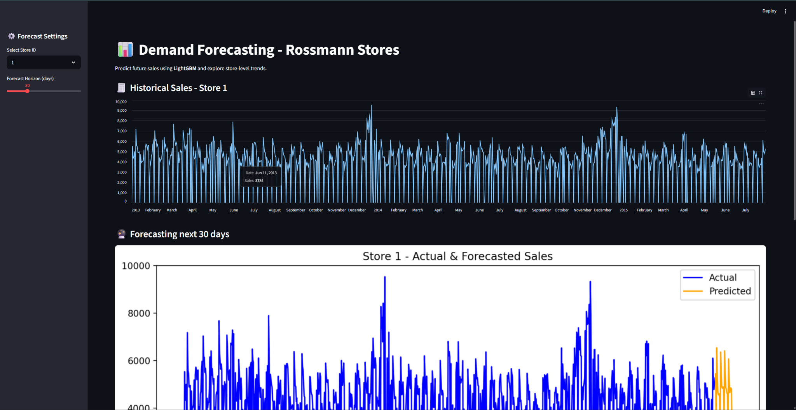
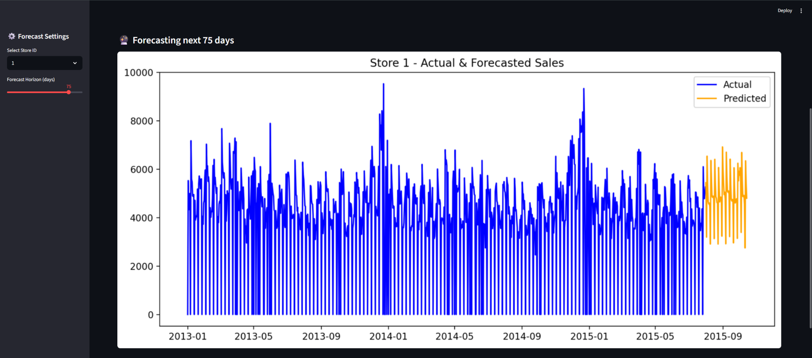

#  Demand Forecasting for Retail Stores (Rossmann Dataset)

**End-to-end demand forecasting system** built to demonstrate data-engineering and applied-ML principles.  
The project predicts future store-level sales using **LightGBM** and **Prophet**, and deploys an interactive
**Streamlit dashboard** for visualization.

---

##  Project Overview

Retailers need accurate demand forecasts to plan inventory, staffing, and promotions.
This project builds a complete forecasting pipeline that ingests raw sales data,
performs feature engineering, trains multiple models, and serves predictions via a web interface.

---

##  Methodology

1. **Data Ingestion**
   - Load `train.csv`, `store.csv`, and `test.csv`.
   - Merge and clean (handle missing competition/promo fields).

2. **Exploratory Data Analysis (EDA)**
   - Understand seasonality, weekly patterns, and promo impact.
   - Visualize sales trends by day, store type, and holidays.

3. **Feature Engineering**
   - Temporal features: `Year`, `Month`, `WeekOfYear`, `DayOfWeek`.
   - Lag & rolling statistics: `Sales_lag_7`, `Sales_roll_mean_7`, etc.
   - Encoded categorical variables: `StoreType`, `Assortment`.

4. **Modeling**
   - **Prophet** for interpretable trend & seasonality.
   - **LightGBM** for high-accuracy, feature-rich regression.

5. **Evaluation**
   - Metrics: **MAE**, **RMSE**.
   - Prophet (baseline): RMSE ≈ 734  
     LightGBM (global model): RMSE ≈ 905, MAE ≈ 586.

6. **Deployment**
   - Streamlit app visualizes historical and predicted sales per store.
   - User selects store ID and forecast horizon (7–90 days).

## Key Results

| Model | MAE | RMSE | Notes |
|--------|-----|------|-------|
| Prophet | 636 | 734 | Single-store baseline |
| LightGBM | **586** | **905** | Global cross-store model with engineered features |

*Model captures weekly cycles, promotions, and holidays effectively.*

##  Streamlit Dashboard

**Features**
- Select any store from sidebar  
- Choose forecast horizon  
- View combined *historical + predicted* trends  
- Explore top feature importances

**Run locally**
```bash
cd app
streamlit run streamlit_app.py
```

##  Dashboard Preview

Below are sample screenshots of the interactive Streamlit forecasting dashboard:

### 🔹 Overall View


### 🔹 Forecasting Next 75 Days


The dashboard allows users to:
- Select any **Store ID**  
- Choose the **forecast horizon (7–90 days)**  
- View both **historical** and **future forecast trends**  
- Explore top **feature importances** driving the model’s predictions  

---

